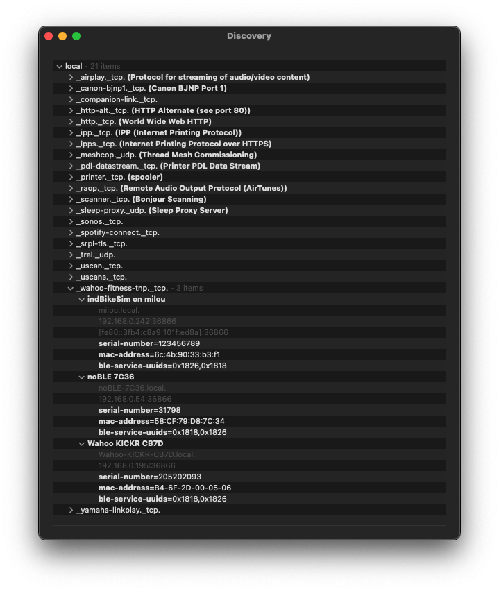

# Introduction

This document is an unofficial specification of the wahoo-fitness-tnp service used by the Direct Connect (DIRCON) protocol. The information herein was obtained by reverse engineering the operation of the protocol, without any reference to the official (proprietary) specification from Wahoo Fitness. 

Wahoo Fitness first intoduced DIRCON in January 2021, via an optional [dongle](https://www.wahoofitness.com/devices/indoor-cycling/accessories/kickr-dircon-buy) that connected to the RJ-11 port on the KICKR V5 indoor trainer.  This DIRCON dongle only worked with wired Ethernet; i.e. there was no support for WiFi.

For an in-depth review of this DIRCON dongle, you can read [this](https://www.dcrainmaker.com/2021/01/wahoo-starts-shipping-kickr-2020-direct-connect-cable-hands-on-details.html) blog post by DC Rainmaker or watch [this](https://youtu.be/XtIM5675dLo?si=B5nM_biNNlvfmuu2) Youtube video from Shane Miller.

At the time of this writing (late 2025) DIRCON is available on a wide range of indoor trainers from different manufacturers.  The table below lists some of them:

| Brand | Model | Enet | WiFi |
|-------|-------|------|------|
|Elite|Justo|Y|N|
|Elite|Justo 2|Y|Y|
|Elite|Avanti|Y|Y|
|JetBlack|Victory|N|Y|
|Tacx|Neo 3M|Y|Y|
|Wahoo|KICKR V5|Y|N|
|Wahoo|KICKR V6|Y|Y|
|Wahoo|KICKR BIKE V2|Y|Y|
|Wahoo|KICKR MOVE|Y|Y|
|Wahoo|KICKR BIKE SHIFT|Y|Y|
|Wahoo|KICKR CORE V2|N|Y|

The trend in the smart trainer market is moving toward built-in Wi-Fi connectivity because it offers a more stable and faster connection than traditional Bluetooth or ANT+ for competitive virtual racing.

# Protocol Overview

At a high level, DIRCON is simply "BLE over TCP/IP".  That is, the Bluetooth Low Energy (BLE) messages normally exchanged between the virtual training app (the BLE client) and the smart trainer (the BLE server) are instead encapsulated and transmitted using a TCP connection over wired Ethernet or WiFi. That's it.

## Service Advertisement

DIRCON uses Multicast DNS (mDNS) to advertise the "wahoo-fitness-tnp" (WFTNP) on the local network, so that a DIRCON-compatible virtual training app (such as FulGaz, Wahoo SYSTM, or Zwift) can find it.

The screenshot below shows the macOS mDNS browser app "Discovery" having discovered three WFTNP devices on the local network. In this case, the "KICKR CB7D" was a Wahoo KICKR V5 bike trainer connected to the home network using the DIRCON dongle.  



The mDNS query response sent by the trainer contains three relevant records:

### A record

The A record indicates the IP address of the trainer.

### SRV record

The SRV record indicates the TCP port number used by WFTNP.

### TXT record

The TXT record includes three strings:

**serial-number** indicates the Serial Number of the device.

**mac-address** indicates the IEEE MAC address of the Ethernet/WiFi network interface of the device.

**ble-service-uuids** contains a comma-separated list of the 16-bit UUID of the BLE services supported by the device.

In the above screenshot all three indoor bike devices advertised the Fitness Machine Service (FTMS) and the Cycling Power Service (CPS), with UUID's 0x1826 and 0x1818, respectively.

## Connection Establishment

DIRCON follows the client-server model, where the virtual training app is the client and the smart trainer device is the server.

Once the virtual training app discovers the smart trainer, it uses the IP address and port number obtained from the mDNS response to establish the TCP connection to the trainer.  Once established, client and server can exchange DIRCON messages, with the client generally sending a request, and the server answering with a response. The exception being the periodic unsolicited notifications the server (smart trainer) sends to the client during the activity.

To reduce the communication overhead, TCP (by default) tries to buffer as much data as possible before sending it to the peer.  Typically, the internal buffering time is about 200 ms. But DIRCON is a time-sensitive protocol, so to reduce the transaction latency it is suggested that the TCP connection use the TCP_NODELAY option, which disables Nagle's algorithm.

And to allow the client and the server to detect connection drops, it is recommended that the TCP connection use the TCP_KEEPALIVE option as well.

## Message Format

The figure below shows the generic DIRCON message format:

```
                        1                   2                   3
    0 1 2 3 4 5 6 7 8 9 0 1 2 3 4 5 6 7 8 9 0 1 2 3 4 5 6 7 8 9 0 1
   +-+-+-+-+-+-+-+-+-+-+-+-+-+-+-+-+-+-+-+-+-+-+-+-+-+-+-+-+-+-+-+-+
   |   Version     |  Message Type |    Seq Num    |  Data Length  |
   +-+-+-+-+-+-+-+-+-+-+-+-+-+-+-+-+-+-+-+-+-+-+-+-+-+-+-+-+-+-+-+-+
   |                               .                               |
   |                               .                               |
   |                          Optional Data                        |
   |                               .                               |
   |                               .                               |
   +-+-+-+-+-+-+-+-+-+-+-+-+-+-+-+-+-+-+-+-+-+-+-+-+-+-+-+-+-+-+-+-+
```

**Version:** Indicates the protocol version number. The current version is 1.

**Message Type:** Indicates the type of message sent or received.

| Msg Type | Description |
|-------|-------|
| 1 | Discover Services |
| 2 | Discover Characteristics |
| 3 | Read Characteristic |
| 4 | Write Characteristic |
| 5 | Enable Characteristic Notifications |
| 6 | Characteristic Notification |

**Seq Num:** Indicates the sequence number of the message.

**Data Length:** Indicates the length (in bytes) of the optional data that follows the fixed message header.


